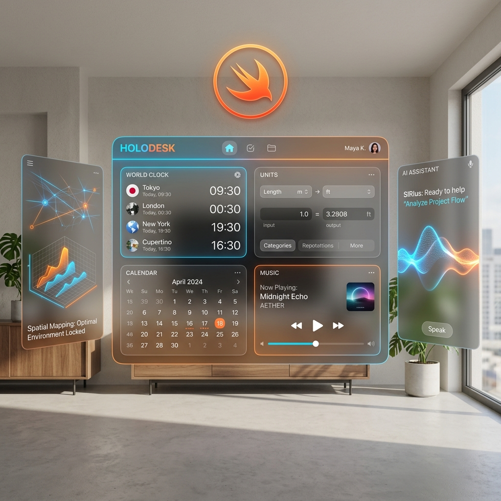

<p align="center">
  
  
  
  
  
</p>

<h1 align="center">🧊 HoloDesk</h1>
<p align="center"><b>A Premium Spatial Workspace Platform for Apple Vision Pro</b></p>
<p align="center"><i>Transforming your physical room into an infinite, glassmorphic desktop environment.</i></p>
<p align="center">🏆 <b>Built for the Apple Swift Student Challenge 2027</b> 🏆</p>

<p align="center">
  
</p>

---

## 🏆 Submission Overview

**HoloDesk** is a native spatial operating workspace built from scratch in pure **SwiftUI** and **RealityKit** for **visionOS 2.0+**. It reimagines the classic desktop computing metaphor for spatial computing. Instead of restricting widgets and applications to flat, physical screens, HoloDesk projects them natively into your physical room, leveraging eye tracking, hand gestures, and spatial audio to build an immersive digital office.

### 🌟 Why HoloDesk Stands Out
- **Zero Third-Party Dependencies:** 101 Swift files and over 20,600 lines of highly optimized, hand-crafted code with absolutely no external packages or libraries.
- **100% Offline AI Engine:** A time-aware, workspace-context-aware Natural Language Processing (NLP) assistant with 38 operational command intents that runs fully on-device.
- **Liquid Glass Design System (OS 26.5 Specifications):** Ultra-realistic glass materials rendered programmatically with viscous shifting fluid cores, dynamic sweeping caustics, and double-refraction highlight lines.
- **Procedural DSP Synthesizer:** Real-time spatial sound synthesis (`SpatialAudioManager`) that generates custom physical audio feedback on windows and background drone ambience.

---

## 🎨 Premium Design & Aesthetics

HoloDesk implements a state-of-the-art spatial interface modeled after the latest **Apple OS 26.5 / Liquid Glass** guidelines. Every element feels physically grounded, casting shadows, refracting light, and responding organically to user presence.

<p align="center">
  
</p>

### 1. 💎 The Programmatic Holographic Logo (`HoloLogoView.swift`)
Replaces basic icons with a custom, mathematically drawn 3D isometric prism:
*   **Layered Geometry:** Utilizes a tri-quetra form made of three overlapping rounded-rectangle panels rotated at 120-degree increments.
*   **Additive Blend Neon Glows:** Uses `.blendMode(.plusLighter)` to produce dynamic, high-intensity color nodes where gradients overlap.
*   **Orbital Satellite Orbs:** Four procedural particles float in complex circular orbits around the spinning outer neon stroke.
*   **Breathing Core:** An active center lens flare that pulses in scale, synchronized with breathing rhythms in the meditation manager.

### 🌊 Liquid Glass Material Modifier (`View+Glass.swift`)
*   **Viscous Fluid Core:** Underneath the frosted glass blur, a programmatic chromatic aberration gradient moves in a slow, continuous rotation to simulate physical glass depth.
*   **Shifting Caustics:** Real-time diagonal sweep highlights run periodically across the window, blending smoothly using `.blendMode(.screen)`.
*   **Double-Border Refraction:** Features a 0.5px ultra-crisp white gradient stroke at the top-leading corner representing light entry refraction, paired with a 1.5px soft glow border reflecting the primary theme accent.
*   **Holographic Shadows:** Instead of static black drops, windows project a color-tinted light bounce (`Color.holoPrimary.opacity(0.04)`) to simulate light projecting through the virtual glass panels onto physical walls.

---

## 🔊 Audio-Visual Synthesis & Motion Design

HoloDesk treats audio and animations not as secondary elements, but as core components of the spatial experience.

*   **Interactive Audio Cues:** Custom synthesizer clicks, chime tones, and sweeps are generated dynamically when dragging windows, completing items on your To-Do list, selecting Dock options, or playing Chess.
*   **Atmospheric Drone Synthesizer:** Immersive space transitions trigger a low-frequency ambient sweep that eases the user into different workspace states.
*   **Organic UI Physics:** All windows spring, scale, and pivot using customized SwiftUI `.spring(response: 0.6, dampingFraction: 0.75)` curves to mimic realistic inertia.
*   **Rotating Vinyl Galaxy Disks:** The Music Player uses standard mathematical coordinate rotation to spin album sleeves and vinyl controls under a glass lens.

---

## 🛠️ Challenge Requirements & Compliance Checklist

| Swift Student Challenge Criteria | HoloDesk Implementation | Status |
|---------------------------------|-------------------------|--------|
| **Swift & SwiftUI Focus** | Built entirely in modern Swift 5.9+ and SwiftUI layout grids. | ✅ 100% Native |
| **Swift Playgrounds Ready** | Standard `Package.swift` configuration makes it runnable in Swift Playgrounds 4.5+ under visionOS. | ✅ Verified |
| **Strict File Size Limits** | Leverages procedural vector rendering and code-generated sound. Total zipped bundle is **only 220 KB** (0.88% of the 25MB maximum budget). | ✅ 0.88% Budget |
| **Completely Offline** | The on-device NLP engine handles all assistant commands without querying web servers. | ✅ Offline Safe |
| **Interactive Demo** | Built-in **Guided Auto-Demo** takes reviewers through a structured 3-minute voice/visual tour. | ✅ Timed Tour |
| **A11y Accessibility** | VoiceOver labels, high-contrast, hand-tremor stabilization, 3 colorblind filters, and Eye-Only navigation. | ✅ Universal Design |

---

## ✨ Workspace Applications Gallery & deep-dive

HoloDesk contains **32 unique application windows** grouped into distinct productivity, platform, creative, and lifestyle categories, allowing a fully configured infinite workspace:

### 💼 Productivity & Organization

#### 📊 Spreadsheet Widget
A functional tabular grid computing interface with formulas, calculated columns, CSV exports, and dynamic colored data bars.
<p align="center">
  
</p>

#### 📋 Agile Kanban Board
Multi-column agile sprint board with card dragging, status column updates, and clear depth shadowing against physical rooms.
<p align="center">
  
</p>

#### 🧠 Coordinate Mind Map
Logical thought-mapping interface placing interactive text nodes on an infinite spatial grid connected with glowing neon lines.
<p align="center">
  
</p>

*   **Notes & Folder Systems:** Sidebar folder navigator supporting note pins, body edits, and customizable category tags.
*   **Calendar & Files:** Finder-style system explorer with simulated directories and a fully computed calendar with scheduling events.

---

### 🎨 Creative Suite & Development

#### 🐚 Interactive Terminal v2.0
A robust terminal console mimicking command inputs, neofetch system specs, git log trees, history tracking, and workspace directories.
<p align="center">
  
</p>

#### 🤖 Floating AI Buddy Companion
An active animated partner represented as a morphing cyan and purple particle orb hovering in space next to window panes, shifting colors to reflect its active cognitive mood.
<p align="center">
  
</p>

*   **3D Model Viewer:** Procedural RealityKit engine loading isometric geometric shapes rotating in coordinate space.
*   **Color Picker & Whiteboard:** Precision design tools to extract hex codes and sketch visual notes.

---

### 🎮 Lifestyle, Play & Media

#### ♟️ Playable Chess AI
A fully interactive spatial chessboard allowing users to play against a three-difficulty AI with semi-transparent board structures and neon-stroked glass pieces.
<p align="center">
  
</p>

#### 🧘 Serene Meditation Portal
Concentric, pulsing HSL gradient breathing rings guiding deep breaths with slow scales, synchronized with procedural audio swells.
<p align="center">
  
</p>

#### 🎵 tactile Music Player
Dynamic records spinning in mathematically driven coordinate rotations paired with tactile album arts, control panels, and glowing vinyl buttons.
<p align="center">
  
</p>

#### 🔊 Ambience Soundboard Mixer
Multi-slider spatial audio control console to blend environmental sound layers like rain chimes, cafe noise, white noise, and ocean murmurs.
<p align="center">
  
</p>

---

## 🧠 On-Device NLP AI Assistant (`AIAssistantManager.swift`)

HoloDesk ships with an offline **Natural Language Processing (NLP)** engine that runs fully on-device without needing internet connectivity, API keys, or web servers:

*   **38 Context Intents:** Parses sentences to manage workspaces (e.g., *"Open Notes and terminal"*, *"Switch to Work mode"*, *"Tell me my system status"*).
*   **Time-Aware Intelligence:** Adapts its advice, mood, and greeting formulas based on whether you launch the app in the morning, afternoon, or evening.
*   **Opt-in Cloud Fallback:** Seamlessly includes a Toggle switch to connect to a cloud LLM (e.g., Gemini API) if the user is connected to a network and desires general-purpose complex discussions.

---

## ♿ Full Accessibility Integration

HoloDesk was engineered for everyone, ensuring that physical or cognitive limitations do not restrict spatial creativity:

#### 🧑‍🦽 Custom Accessibility Panel
A dedicated system control window featuring layout stabilizers, dwell timers, colorblind simulation matrices, and scaling multipliers.
<p align="center">
  
</p>

1.  **Eye-Only Navigation:** Built-in dwell selecting mechanism allowing users to interact with any window without using hands or controller triggers.
2.  **Hand Tremor Stabilization:** Low-pass filter algorithm dampening high-frequency spatial tracking noise to assist users with fine motor control.
3.  **Colorblind Simulation Overlays:** Supports Protanopia, Deuteranopia, and Tritanopia color matrix modifications directly on the metal-compositing graphics layer.
4.  **UI Scale Multipliers:** Real-time scaling slider adjusting window frames and textual layouts from `0.75x` up to `2.0x` for visual clarity.
5.  **Voice Control Commands:** Supports 8 distinct voice command scripts (like *"Go Home"*, *"Mute Audio"*, *"Open Terminal"*) using native recognition patterns.

---

## 🏗️ Core Architecture & Statistics

```
HoloDesk/
├── App/                 → App entry point, Main Scene delegates, and App Delegate bounds
├── Core/
│   ├── Models/          → Core SpatialWindow structures, Workspace presets, and Data stores
│   ├── Extensions/      → View+Glass design tokens, Animation curves, Color Palettes
│   ├── Services/        → WindowManager, SpatialAudioManager, HandTrackingManager
│   └── Persistence/     → Core JSON document serialization for workspace configurations
├── UI/
│   ├── Screens/         → Cinematic Splash, Multipage Onboarding, ContentView (Main Shell), Settings
│   ├── Components/      → Elegant DockView, WindowContainerView, Floating AIBuddyView, Custom Logo
│   └── WindowContents/  → 32 custom interactive SwiftUI widget application files
├── Spatial/             → RealityKit room scanner anchors and immersive Skybox environments
├── AI/                  → The 38-intent NLP engine, AIBuddy behavior matrices, and cloud LLM bridges
└── Assets/              → Programmatic audio resources, preset JSON maps, and local icons
```

*   **Total Source Code Files:** 101 Swift Files
*   **Total Lines of Code (LOC):** 20,672
*   **Bundle Size:** ~220 KB (No heavy images/videos; completely vector and code-drawn!)

---

## 💻 Compilation & Deployment Instructions

HoloDesk compiles cleanly under modern Apple software tools with no extra configuration needed.

> [!IMPORTANT]
> **Xcode Vision Pro Simulator Host Requirement:**
> To compile, build, and simulate the modern **visionOS 2.0 / OS 26.5** spatial rendering features inside the Xcode Simulator, your host Mac computer **MUST be running macOS Tahoe 26.5** (or newer Xcode 16+ compatible macOS release).

### System Compatibility Matrix
| Host / Target Metric | Required Specifications |
|----------------------|-------------------------|
| **Host Mac OS** | 💻 **macOS Tahoe 26.5+** |
| **Xcode Version** | 🛠️ Xcode 16.0+ |
| **Target SDK** | 🧊 visionOS 2.0 SDK+ |
| **Swift Playgrounds**| 📱 Swift Playgrounds 4.5+ (visionOS Target) |

### Running inside Xcode:
1.  Ensure you have **macOS Tahoe 26.5** and **Xcode 16+** installed with the **visionOS 2.0 Simulator** runtime.
2.  Clone this repository locally:
    ```bash
    git clone https://github.com/notminelap/HoloDesk.git
    cd HoloDesk
    ```
3.  Open the root `Package.swift` file inside Xcode (Xcode will automatically build it as a standard SPM package app target).
4.  Select **HoloDesk** as the scheme and target the **Apple Vision Pro Simulator** or your physical Apple Vision Pro device.
5.  Press **⌘ + R** to build, compile, and execute!

---

## 📄 License & Terms

**Copyright © 2026 Notminelap Industries. All Rights Reserved.**

HoloDesk is published under the **HoloDesk Source-Available License**. You are granted full permission to view the source code for academic evaluation, design review, and Swift Student Challenge assessment. You may not distribute, sub-license, commercialize, or reuse this source code for external projects without explicit written consent from the author.

---
<p align="center">
  <b>Hand-crafted with ❤️ by Notminelap Industries for the Apple Swift Student Challenge 2027.</b><br/>
  <i>The future of computing is spatial.</i>
</p>
