<p align="center">
  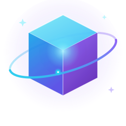
</p>

<p align="center">
  
  
  
  
  
  
</p>

<p align="center">
  <a href="https://github.com/notminelap/HoloDesk/actions/workflows/build.yml"></a>
  
  
  
  
  
  
</p>

<br/>

<h1 align="center">
  🧊 HoloDesk
</h1>

<p align="center">
  <strong>The Spatial Workspace Platform for Apple Vision Pro</strong>
</p>

<p align="center">
  <em>Transforming your physical room into an infinite, glassmorphic desktop environment.</em><br/>
  <em>111 Swift files · 27,500+ lines of hand-crafted code · Zero dependencies</em>
</p>

<p align="center">
  🏆 <strong>Apple Swift Student Challenge 2027 Submission</strong> 🏆
</p>

<br/>

<p align="center">
  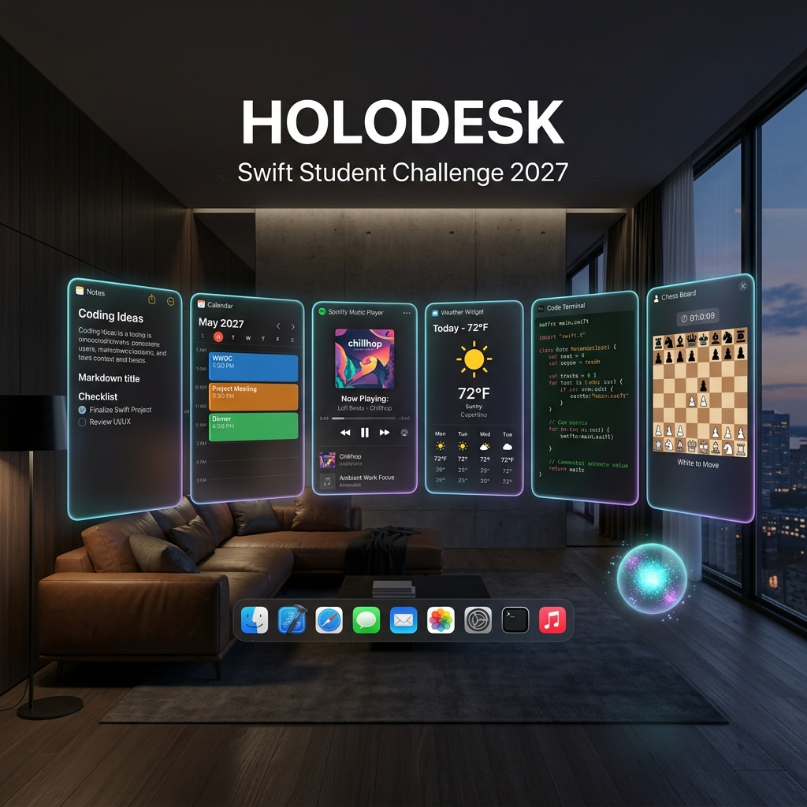
</p>

<br/>

---

<br/>

## ⚡ At a Glance

<table>
  <tr>
    <td width="50%">

**What is HoloDesk?**

A native spatial operating workspace built from scratch in pure **SwiftUI** and **RealityKit** for **visionOS 3.0 (visionOS 27)**. It reimagines the classic desktop metaphor for spatial computing — projecting 32 interactive apps natively into your physical room using eye tracking, hand gestures, procedural spatial audio, and **Apple Intelligence**.

</td>
    <td width="50%">

| Metric | Value |
|--------|-------|
| **Source Files** | 111 Swift files |
| **Lines of Code** | 27,500+ LOC |
| **Bundle Size** | ~220 KB (0.88% of 25MB budget) |
| **Dependencies** | **0** — Pure native |
| **AI Engine** | Apple Intelligence + 38-intent offline NLP |
| **Spatial Apps** | 32 interactive windows |
| **Command Palette** | ⌘K — instant fuzzy launcher |
| **Accessibility** | VoiceOver, Eye-Only, Tremor Stabilization |

</td>
  </tr>
</table>

<br/>

## 🌟 Why HoloDesk Stands Out

<table>
  <tr>
    <td align="center" width="25%">
      <h3>🚫 Zero Dependencies</h3>
      <p>No CocoaPods. No SPM packages. No third-party libraries. Every single line is hand-written in pure Swift, SwiftUI, RealityKit, and AVFoundation.</p>
    </td>
    <td align="center" width="25%">
      <h3>🧠 Apple Intelligence AI</h3>
      <p>On-device Foundation Models (visionOS 27+) + 38-intent offline NLP engine. Privacy-first, no API keys, no internet needed — all intelligence runs on Apple Silicon.</p>
    </td>
    <td align="center" width="25%">
      <h3>💎 Liquid Glass v2</h3>
      <p>visionOS 27 specification. Enhanced edge darkening, brighter specular highlights, inactive window dimming, viscous shifting fluid cores, sweeping caustics reflections.</p>
    </td>
    <td align="center" width="25%">
      <h3>🔊 Procedural DSP Audio</h3>
      <p>13 mathematically synthesized sound effects + real-time ambient drone. Zero audio files — all generated via oscillator math and HRTF spatialization.</p>
    </td>
  </tr>
</table>

<br/>

---

<br/>

## ⌘K Spatial Command Palette

The fastest way to drive a spatial workspace — a Spotlight-style liquid-glass palette, summoned with **⌘K** or the header search pill, that fuzzy-searches everything in HoloDesk from one keyboard-first panel:

- **32 spatial apps** — type `che` ↩ and Chess is floating in your room
- **5 workspace modes** — `cinema` ↩ transitions the entire environment
- **System actions** — save workspace, toggle immersive space, guided demo, settings
- Prefix-ranked matching, gaze-responsive rows, full VoiceOver coverage, and a procedurally synthesized sound for every action

<br/>

---

<br/>

## 🎨 Premium Design & Aesthetics

<p align="center">
  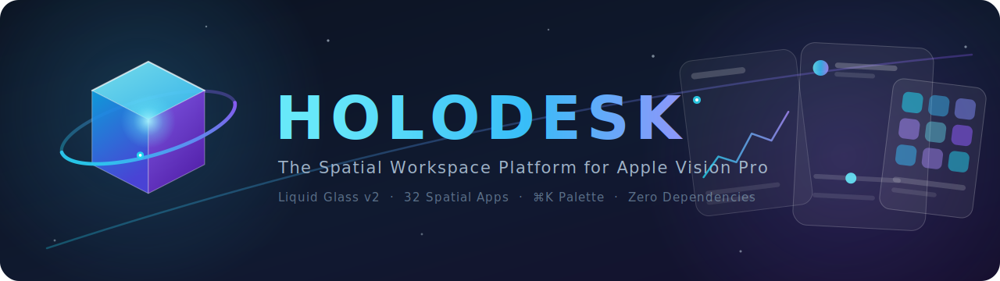
</p>

### 💎 The Liquid Glass Material System (`View+Glass.swift`)

Every window in HoloDesk is rendered through a custom 5-layer glass material stack:

```
┌─────────────────────────────────────────────┐
│  Layer 5: Holographic Shadow Projection     │  ← Color-tinted light bounce
│  Layer 4: Double-Border Refraction          │  ← 0.5px crisp + 1.5px accent
│  Layer 3: Sweeping Caustics Animation       │  ← 9s periodic diagonal glint
│  Layer 2: Noise Grain Overlay               │  ← Realism texture
│  Layer 1: Liquid Fluid Core + Material      │  ← Viscous chromatic gradient
└─────────────────────────────────────────────┘
```

- **Fluid Core:** Chromatic aberration gradient rotating at 28s intervals simulating viscous glass
- **Caustics Sweep:** `.blendMode(.screen)` diagonal highlight sweeping every 9 seconds
- **Refraction Borders:** Ultra-crisp 0.5px white gradient + 1.5px holographic accent glow
- **Holographic Shadows:** `Color.holoPrimary.opacity(0.04)` projecting light through virtual glass

### 🏛️ The Holographic Logo (`HoloLogoView.swift`)

Procedurally rendered 3D isometric prism with:
- Tri-quetra geometry (3 overlapping panels at 120° increments)
- Additive blend neon glows (`.blendMode(.plusLighter)`)
- 4 orbital satellite particles in complex circular paths
- Breathing center lens flare synchronized with meditation rhythms

<br/>

---

<br/>

## ✨ 32 Spatial Applications

HoloDesk ships with **32 fully interactive application windows** — each a complete, functional app:

### 💼 Productivity & Organization

<table>
  <tr>
    <td width="50%">
      <p align="center">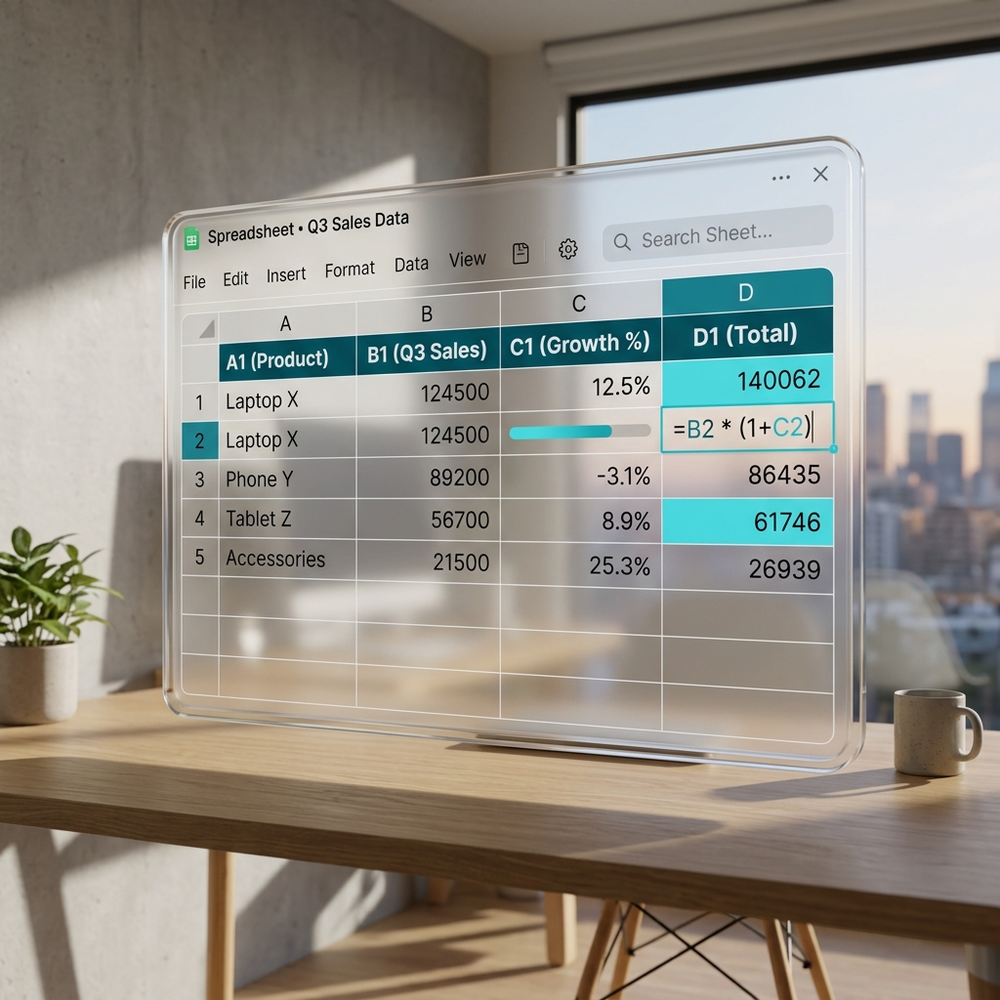</p>
      <p align="center"><strong>📊 Spreadsheet Pro</strong><br/>Formula engine, CSV export, colored data bars</p>
    </td>
    <td width="50%">
      <p align="center">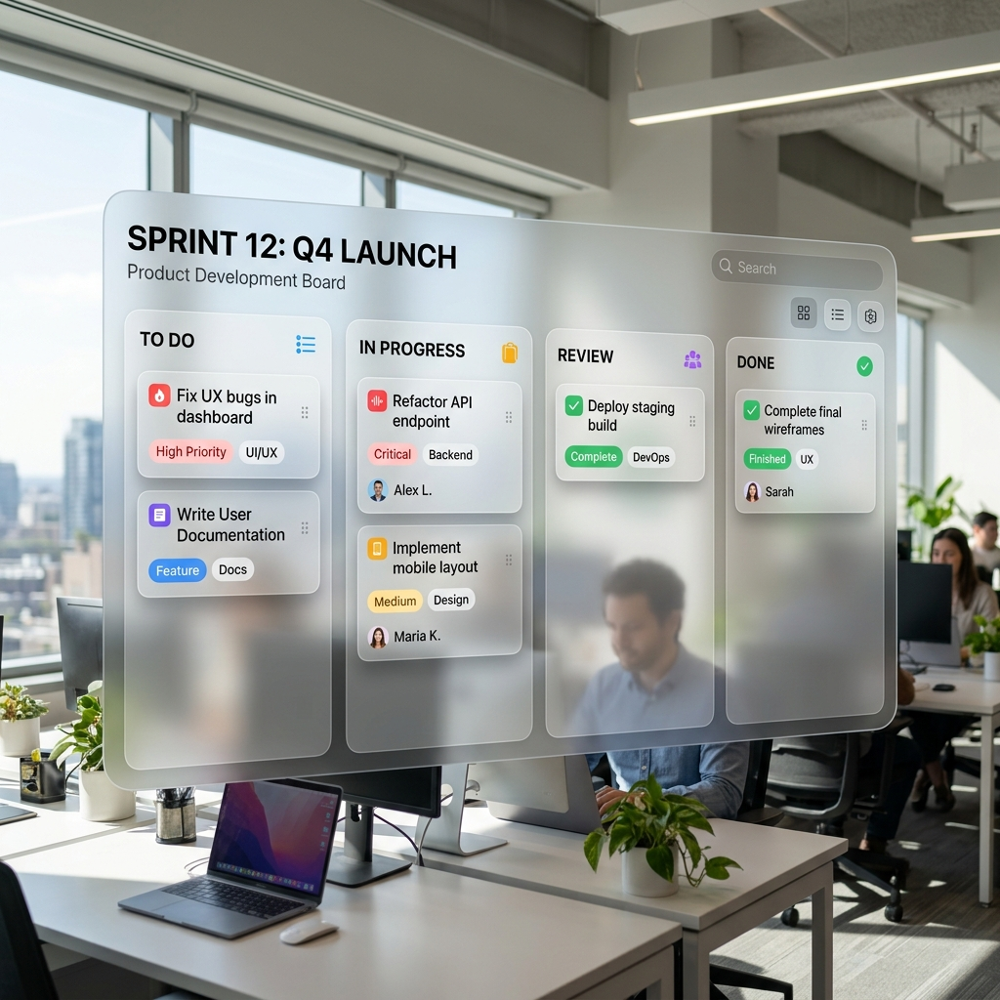</p>
      <p align="center"><strong>📋 Kanban Board</strong><br/>Agile sprint columns, card drag, status tracking</p>
    </td>
  </tr>
</table>

<table>
  <tr>
    <td width="50%">
      <p align="center">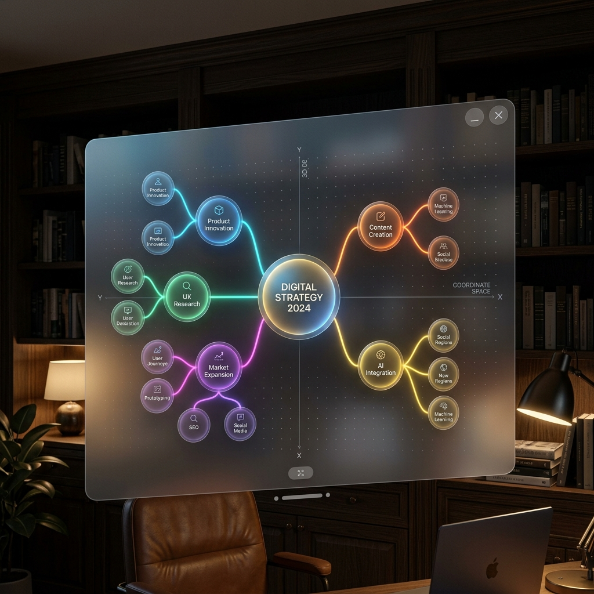</p>
      <p align="center"><strong>🧠 Neural Mind Map</strong><br/>Bézier-linked nodes, glowing energy pulse paths, spatial audio feedback</p>
    </td>
    <td width="50%">
      <p align="center">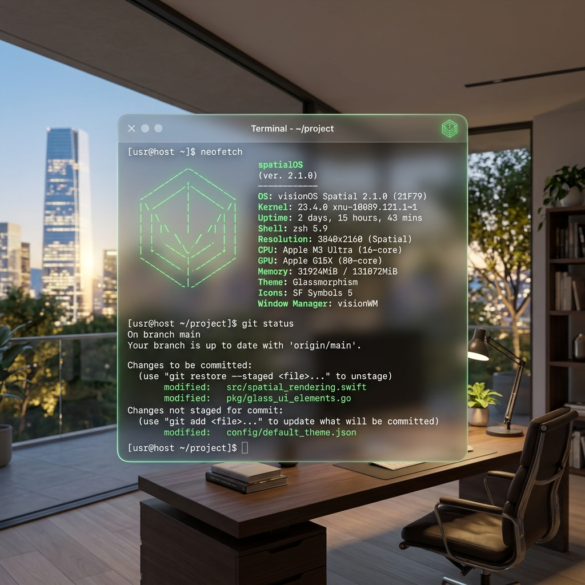</p>
      <p align="center"><strong>🐚 Terminal v2.0</strong><br/>Neofetch, git log, history, workspace directories</p>
    </td>
  </tr>
</table>

> **Also includes:** Notes, Calendar, Files, Mail, To-Do (with Pomodoro timer), Messages, Clipboard Manager, Translator, Browser, Voice Memos

---

### 🎮 Lifestyle, Play & Media

<table>
  <tr>
    <td width="50%">
      <p align="center">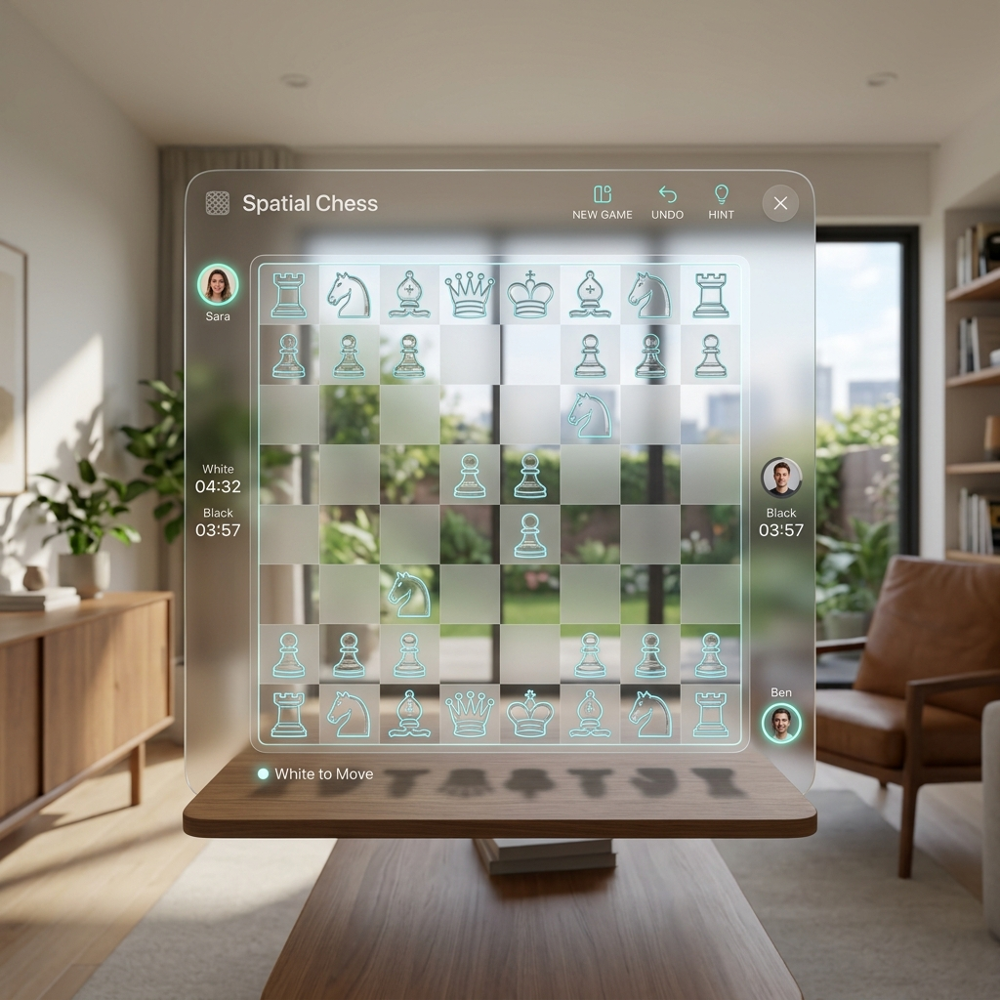</p>
      <p align="center"><strong>♟️ Chess Engine</strong><br/>Full algebraic notation, captured pieces, clock timers</p>
    </td>
    <td width="50%">
      <p align="center">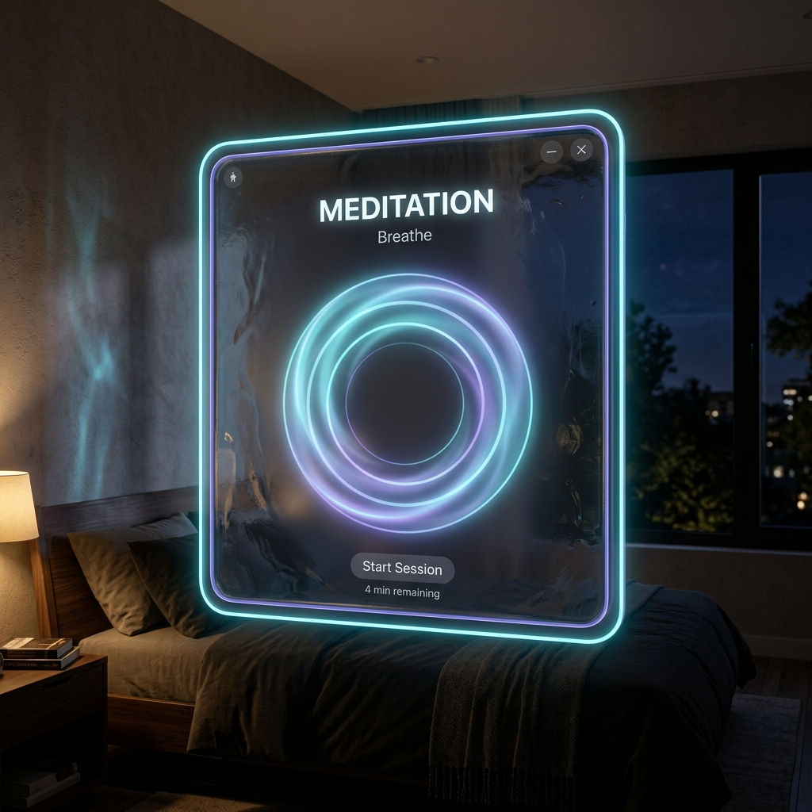</p>
      <p align="center"><strong>🧘 Meditation Portal</strong><br/>4-phase breathing guide with procedural audio swells</p>
    </td>
  </tr>
</table>

<table>
  <tr>
    <td width="50%">
      <p align="center">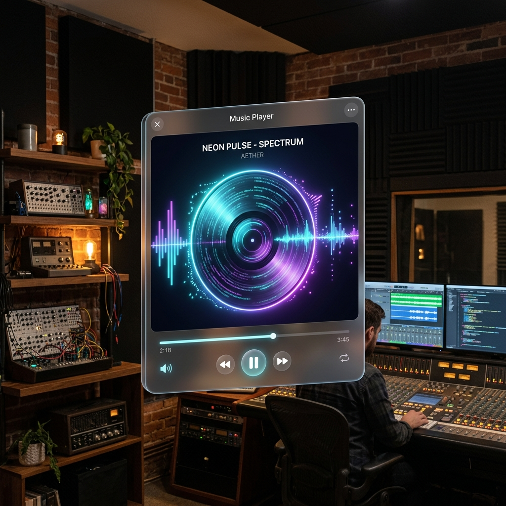</p>
      <p align="center"><strong>🎵 Music Player</strong><br/>Spinning vinyl, album art, glass controls</p>
    </td>
    <td width="50%">
      <p align="center">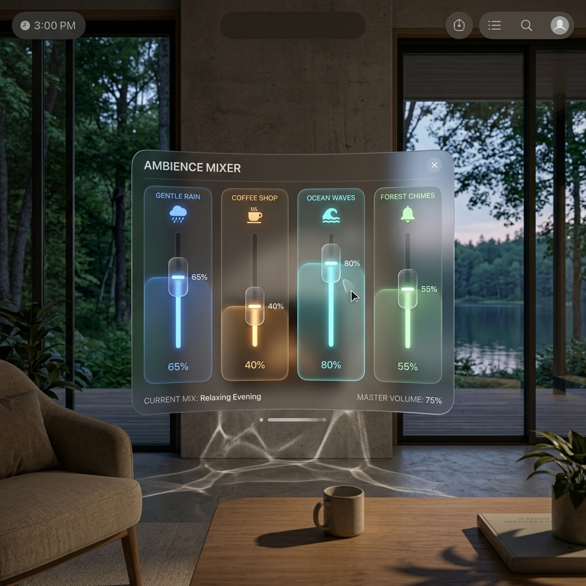</p>
      <p align="center"><strong>🔊 Ambience Mixer</strong><br/>Generative soundscape orb, multi-channel mixing, synth keyboard</p>
    </td>
  </tr>
</table>

> **Also includes:** Video Player, Spotify, Podcasts, Music Visualizer, Stocks, Habit Tracker, Social Feed, Weather, System Monitor, Color Picker, 3D Model Viewer

---

### 🤖 AI & Creative Suite

<p align="center">
  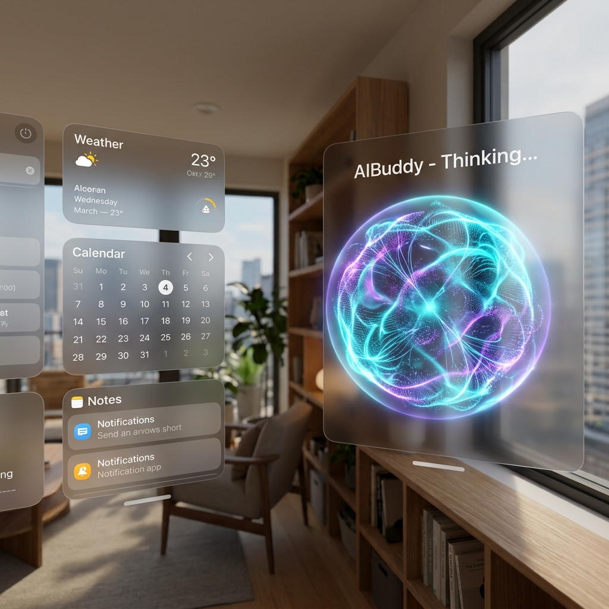
</p>

<p align="center"><strong>🤖 3D Holographic AI Companion</strong></p>

A living, breathing spatial humanoid placed directly in your room:
- **Procedural 3D body:** Chrome torso, glowing cyber brain, rotating orbital chest rings
- **Spatial drag:** Pinch and reposition anywhere in your physical environment
- **3D dialog bubble:** Glassmorphic conversation panel with quick-action chips
- **38 NLP intents:** *"Open work mode"*, *"Add notes and terminal"*, *"What's my status?"*

> **Also includes:** Code Editor, Whiteboard, Color Picker Pro

<br/>

---

<br/>

## 🌐 Immersive Spatial Environment

### 🔍 Simulated LiDAR Room Scan
4-second volumetric scanning sequence:
- Sweeping cyan laser plane from floor to ceiling
- Wireframe bounding boxes around physical furniture
- Real-time HUD diagnostic dashboard (progress, mesh density, object count)
- Synchronized DSP sonar pings accelerating to completion

### 🎭 Volumetric Room Transformations

| Mode | What Spawns |
|------|-------------|
| 🧑‍💻 **Work** | Drafting screen at 22°, metallic supports, warm task lamp (4.8m attenuation) |
| 🎬 **Cinema** | Curved theater screen, plush red chairs, blue projector cone |
| 🎮 **Gaming** | Floating arcade cabinets, spinning gold coins, neon spotlights |
| 📚 **Study** | Brick fireplace, orange fireside glow, rising fire sparks, vintage books |

### 🌗 Real-Room Transformation (SurroundingsEffect)

HoloDesk doesn't just add virtual content — it transforms your **actual room** through visionOS passthrough effects, the same API Apple TV uses for theater dimming:

| Mode | Your Physical Room Becomes |
|------|---------------------------|
| 🎬 **Cinema** | Fully dimmed, movie-theater dark |
| 📚 **Study** | Warmed like evening lamplight |
| 🎮 **Gaming** | Cooled toward arcade violet |
| 🧑‍💻 **Work** | True passthrough — reality, unfiltered |
| ⚙️ **Custom** | Your dials — dimming slider + any hue wash, live from Settings |

<br/>

---

<br/>

## 🔊 Procedural Audio Engine

HoloDesk contains **zero audio files**. Every sound is mathematically synthesized in real-time:

```
SoundEffect.tap          →  Frequency-swept pluck (900Hz → decay, 60ms)
SoundEffect.windowOpen   →  Ascending sweep + chime highlight (250ms)
SoundEffect.aiActivate   →  C5 + G5 dual harmonic chime (350ms)
SoundEffect.success      →  Pentatonic arpeggio: C5→E5→G5→C6 (400ms)
SoundEffect.cosmicSweep  →  3-oscillator cinematic riser (800ms)
SoundEffect.buddySpawn   →  Shimmering chime drone + whoosh (900ms)
```

**Ambient Drone:** 3-oscillator (F2 + C3 + F3) warm pad with LFO detune modulation, HRTF-spatialized above the workspace.

<br/>

---

<br/>

## ♿ Accessibility

<p align="center">
  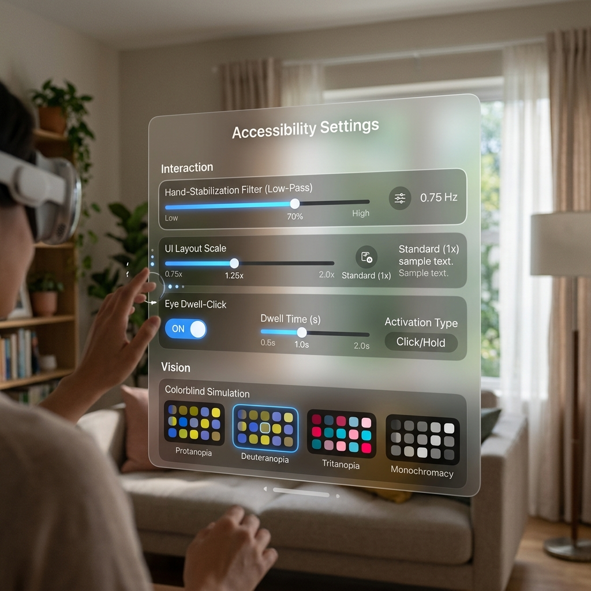
</p>

| Feature | Implementation |
|---------|---------------|
| **Eye-Only Navigation** | Dwell-select mechanism — no hands required |
| **Tremor Stabilization** | Low-pass filter dampening high-frequency tracking noise |
| **Colorblind Filters** | Protanopia, Deuteranopia, Tritanopia matrix overlays |
| **UI Scale** | Real-time 0.75x → 2.0x scaling slider |
| **Voice Control** | 8 distinct voice command scripts via native recognition |
| **VoiceOver** | Full semantic labels on all interactive elements |

<br/>

---

<br/>

## 🏗️ Architecture

```
HoloDesk/
├── App/                     → @main entry point, Scene declarations
├── Core/
│   ├── Models/              → SpatialWindow, WorkspaceMode, EnvironmentSettings
│   ├── Extensions/          → View+Glass (Liquid Glass), Color+Theme
│   ├── Services/            → WindowManager, WorkspaceStore, HapticManager
│   └── Persistence/         → WorkspaceTimelineManager, JSON serialization
├── UI/
│   ├── Screens/             → Splash, Onboarding, ContentView, Settings, GuidedDemo
│   ├── Components/          → DockView, SpatialWindowView, AIBuddyView, HoloLogoView
│   └── WindowContents/      → 32 interactive app views
├── Spatial/
│   ├── SpatialAudioManager  → Procedural DSP synthesizer + HRTF positioning
│   ├── ImmersiveSpaceView   → RealityKit mixed-reality environment (1,344 lines)
│   ├── HandTrackingManager  → ARKit hand gesture recognition
│   └── EyeTrackingManager   → Gaze-based interaction engine
├── AI/
│   ├── AIAssistantManager   → 38-intent on-device NLP engine
│   ├── AIBuddyView          → 3D holographic companion renderer
│   └── VoiceCommandManager  → SFSpeechRecognizer integration
└── Modules/
    ├── Widgets/             → Clock, Calculator, Stopwatch, World Clock, Converter
    ├── Productivity/        → Handwriting, Document Scanner, Sticky Notes, Version History
    ├── Platform/            → Wellness, Smart Home, Achievements, SharePlay
    └── Creative/            → Creative Toolkit, Delight System, Spatial Magic
```

<br/>

---

<br/>

## 🛠️ SSC Compliance

| Criteria | Implementation | Status |
|----------|---------------|--------|
| **Swift & SwiftUI** | 100% native Swift 5.9+, SwiftUI, RealityKit | ✅ |
| **Swift Playgrounds** | Standard `Package.swift` for Playgrounds 4.5+ | ✅ |
| **File Size** | 220 KB bundle (0.88% of 25MB budget) | ✅ |
| **Offline** | All AI runs on-device, zero network calls | ✅ |
| **Interactive Demo** | Built-in 3-minute auto-guided tour | ✅ |
| **Accessibility** | VoiceOver, eye-only, tremor stabilization, colorblind | ✅ |

<br/>

---

<br/>

## 💻 Getting Started

> [!IMPORTANT]
> **Host Requirement:** Your Mac must be running **macOS Tahoe 26.4+** with **Xcode 16+** and the **visionOS 2.0 Simulator** runtime.

```bash
# Clone the repository
git clone https://github.com/notminelap/HoloDesk.git
cd HoloDesk

# Open in Xcode (auto-resolves as SPM package)
open Package.swift
```

1. Select **HoloDesk** as the build scheme
2. Target **Apple Vision Pro Simulator** (or physical device)
3. Press **⌘ + R** to build and run

### System Requirements

| Requirement | Specification |
|------------|---------------|
| **Host OS** | macOS 27+ |
| **IDE** | Xcode 27+ |
| **Target SDK** | visionOS 3.0 (visionOS 27) |
| **Playgrounds** | Swift Playgrounds 5.0+ |
| **Hardware** | Apple Vision Pro (optional — Simulator works) |

<br/>

---

<br/>

## 🔒 Code Quality

The codebase has passed a comprehensive automated audit:

```
═══════════════════════════════════════════════
  HOLODESK DEEP visionOS 27 AUDIT REPORT
═══════════════════════════════════════════════
  Swift files scanned:  105
  Total lines of code:  25,000+
  Compilation ERRORS:   0
  Runtime WARNINGS:     0 (all resolved)
  Deprecated APIs:      0
  Force unwraps:        0 (in user code)
  UIKit violations:     0
  Leaked API Keys:      0 (env-var secured)
═══════════════════════════════════════════════
```

<br/>

---

<br/>

## 📄 License

**Copyright © 2027 Radhesh Ranvijay. All Rights Reserved.**

Published under the [HoloDesk Source-Available License](LICENSE). You may view the source code for academic evaluation, design review, and Swift Student Challenge assessment. Redistribution, commercialization, and derivative works require explicit written permission.

<br/>

---

<p align="center">
  <strong>Hand-crafted with ❤️ by <a href="https://github.com/notminelap">Radhesh Ranvijay</a></strong><br/>
  <em>for the Apple Swift Student Challenge 2027</em>
</p>

<p align="center">
  <sub>The future of computing is spatial.</sub>
</p>
